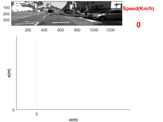
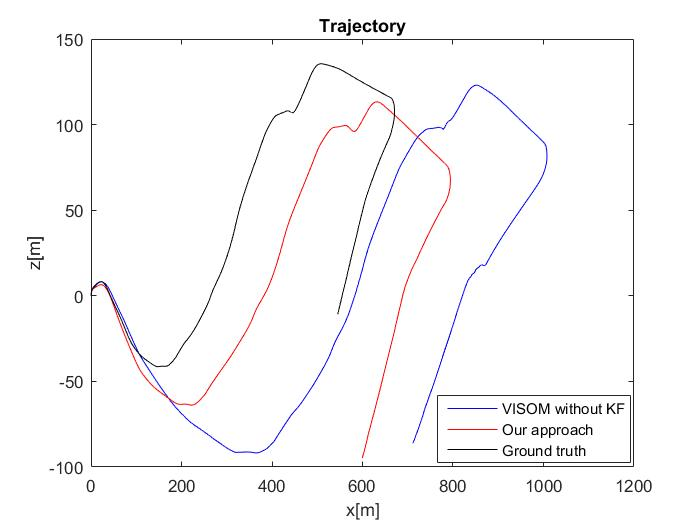
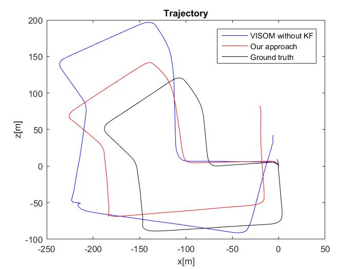
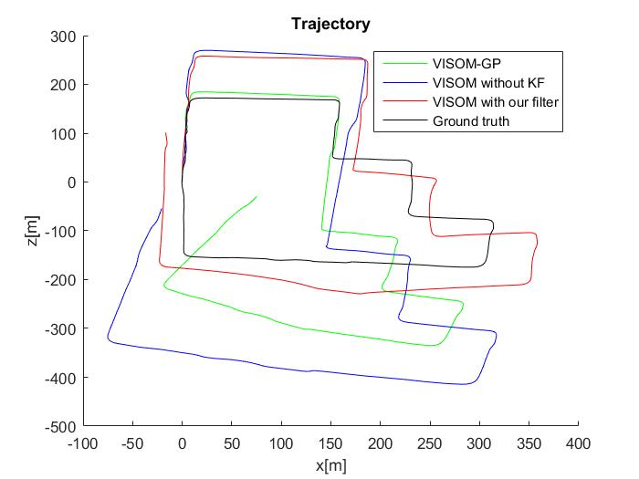

# [Masters Thesis](https://macsphere.mcmaster.ca/bitstream/11375/23085/2/Alizadeh_Sara_2017September_M.A.Sc.pdf)

 

## Description

A monocular Visual Odometry system has been developed and tested on different
datasets and the outputs have been compared with the available ground truth information to analyze the precision of the system. This system is capable of estimating
the 3D position of a ground vehicle robustly and in real time.
One of the main challenges of monocular VO is the ambiguity of the scale estimation which is addressed by assuming that the ground is locally planar and the height
of the mounted camera from the ground is fixed and known.
In order to improve the VO estimation and to help other stages of VO process an
effective filtering approach is utilized. It is shown that an IMM filtering can address
the needs of this specific application, as the movement of a ground vehicle is different
depending on different scenarios.
The results of simulation on the well-known KITTI dataset demonstrates that
our system’s accuracy improved compared to what is considered to be one of the best
state-of-the-art monocular Visual Odometry system.

The full version of the thesis is available here: https://macsphere.mcmaster.ca/bitstream/11375/23085/2/Alizadeh_Sara_2017September_M.A.Sc.pdf

<table>
  <tr>
    <td>Example Result</td>

  </tr>
  <tr>
    <td></td>
  </tr>
 </table>

This repository has the following folders:

1.  [src](#src)
2.  [matlab](#matlab)
3.  [img](#img)

 

## 1. src (C++ library) 

This folder contains the [libviso](http://www.cvlibs.net/software/libviso/) library which is a cross-platfrom (Linux, Windows) open source C++
library with MATLAB wrappers for computing the 6 DOF motion of a moving stereo
camera. Input is a sequence of images. Output is a 6D vector
containing the motion between 2 consecutive frames.

 

## 2. matlab 

This folder contains the matlab wrapper that gets the input as sequence of images (video) and run the proposed Bayesian Machine Learning algorithm on the input data. This computationally efficient algorithms estimates the 3D position of a ground vehicle robustly and in real-time manner. Eextended Kalman Filter and IMM (Interacting Multiple Modle) estimators are used in this implementation.

Here are comparison of the proposed algorithm with some of the existing sate of the arts algorithms for different scenarios of the famous KITTI dataset.

<table>
  <tr>
    <td>Scenario 1</td>
    <td>Scenario 2</td>
    <td>Scenario 3</td>

  </tr>
  <tr>
    <td></td>
    <td></td>
    <td></td>
  </tr>
 </table>

 

## 3. img (results) 

This folder contains a demo result as well as some of the comparison of the proposed algorithm and the existing state of the art methods.
